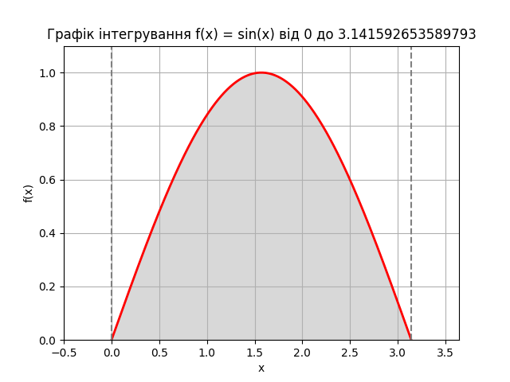

# goit-algo-hw-10

# Висновки по задачах

## Завдання 1: Оптимізація виробництва

### Опис

Розв'язана задача лінійного програмування для максимізації виробництва "Лимонаду" і "Фруктового соку" з урахуванням обмежень на ресурси: воду, цукор, лимонний сік, фруктове пюре.

### Результати

- Кількість Лимонаду: 30;
- Кількість Фруктового соку: 20;
- Максимальна кількість продуктів: 50.

## Завдання 2: Обчислення визначеного інтеграла

### Опис

Метод Монте-Карло був використаний для обчислення значення визначеного інтеграла функції f(x)=sin(x) на інтервалі від 0 до π.
Отримане значення інтеграла методом Монте-Карло було порівняне з аналітичним значенням інтеграла, обчисленого за допомогою функції quad з бібліотеки SciPy.

### Результати

- Інтеграл методом Монте-Карло: 2.0106192982974678;
- Інтеграл аналітичний: 2.0;
- Абсолютна помилка: 2.220446049250313e-14.

### Висновки

Отримані результати демонструють високу точність методу Монте-Карло у порівнянні з аналітичним розрахунком. Абсолютна помилка між результатом Монте-Карло та аналітичним значенням інтеграла є дуже малою, що підтверджує правильність виконаних розрахунків. Метод Монте-Карло є надійним методом для обчислення визначених інтегралів, особливо у випадках, коли аналітичне обчислення є складним або неможливим.
